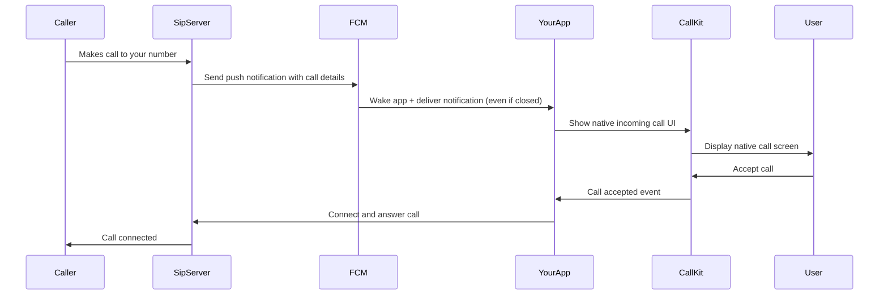

# Background Calls with FCM + CallKit Integration

## Overview

This implementation adds support for receiving VoIP calls when the app is **completely closed** using Firebase Cloud Messaging (FCM) and CallKit. This is the **professional approach** used by apps like WhatsApp, Telegram, etc.

## How It Works



## Setup Required

### 1. Firebase Project Setup

1. **Go to [Firebase Console](https://console.firebase.google.com)**
2. **Create new project** or use existing
3. **Add Android app:**
   - Package name: `com.example.sip_phone`
   - Download `google-services.json`
   - Place in `android/app/google-services.json`
4. **Add iOS app:**
   - Bundle ID: `com.example.sipPhone`
   - Download `GoogleService-Info.plist`
   - Add to iOS project in Xcode

### 2. Android Configuration

Add to `android/app/build.gradle`:
```gradle
plugins {
    id 'com.google.gms.google-services'
}

android {
    compileSdkVersion 34
}

dependencies {
    implementation 'com.google.firebase:firebase-messaging:23.4.0'
    implementation 'com.google.firebase:firebase-core:21.1.1'
}
```

Add to `android/build.gradle`:
```gradle
buildscript {
    dependencies {
        classpath 'com.google.gms:google-services:4.3.15'
    }
}
```

### 3. iOS Configuration

1. **Add `GoogleService-Info.plist`** to iOS project in Xcode
2. **Enable Push Notifications capability** in Xcode
3. **Enable Background Modes:**
   - Background App Refresh
   - Voice over IP
   - Background Processing
4. **Add to `ios/Runner/Info.plist`:**
```xml
<key>UIBackgroundModes</key>
<array>
    <string>audio</string>
    <string>voip</string>
    <string>background-processing</string>
</array>
```

### 4. SIP Server Integration

Your SIP server needs to integrate with FCM to send push notifications:

**When someone calls a user:**
1. **SIP server receives incoming call**
2. **Look up user's FCM token** (from your database)
3. **Send FCM notification:**

```json
{
  "to": "<user_fcm_token>",
  "priority": "high",
  "data": {
    "type": "incoming_call",
    "caller_id": "01687722962",
    "caller_name": "John Doe", 
    "call_uuid": "unique_call_id_123",
    "sip_call_id": "sip_session_id"
  }
}
```

## Implementation Files

### Core Services

1. **`lib/services/fcm_service.dart`** - Handles Firebase Cloud Messaging
2. **`lib/services/callkit_service.dart`** - Manages CallKit integration  
3. **`lib/services/background_call_service.dart`** - Orchestrates background calls
4. **Updated `lib/main.dart`** - Initializes Firebase and services
5. **Updated `lib/screens/settings_screen.dart`** - Shows FCM token and setup

### Key Features

- ✅ **FCM token generation and management**
- ✅ **Background message handling** (app closed/terminated)
- ✅ **CallKit integration** for native call UI
- ✅ **Automatic SIP reconnection** when call accepted
- ✅ **Token display in settings** for server integration
- ✅ **Setup guide and documentation**

## Usage Instructions

### For Users

1. **Go to Settings screen**
2. **Copy the FCM Token** (long string displayed)
3. **Send this token to your SIP server administrator**
4. **Server admin adds token to your account**
5. **Background calls now work!**

### For Server Administrators

1. **Store user FCM tokens** in your database
2. **When call arrives for user:**
   ```php
   // Example PHP code
   $fcmToken = getUserFCMToken($username);
   
   $notification = [
       'to' => $fcmToken,
       'priority' => 'high',
       'data' => [
           'type' => 'incoming_call',
           'caller_id' => $callerNumber,
           'caller_name' => $callerName,
           'call_uuid' => generateUniqueId(),
           'sip_call_id' => $sipCallId
       ]
   ];
   
   sendFCMNotification($notification);
   ```

## Testing

### Test Foreground Calls
Your existing implementation already works perfectly for foreground calls.

### Test Background Calls
1. **Close the app completely**
2. **Have your server send FCM notification** (using token from settings)
3. **Native call screen should appear**
4. **Accept call → app connects to SIP → call established**

## Current Limitations

1. **Firebase setup required** - You need to complete Firebase configuration
2. **Server integration needed** - Your SIP server must send FCM notifications
3. **CallKit API compatibility** - Some CallKit APIs may need adjustment based on package version

## Architecture Benefits

✅ **Professional approach** - Same as WhatsApp, Telegram, etc.
✅ **Battery efficient** - No background services running
✅ **Reliable wake-up** - FCM guarantees delivery
✅ **Native UI** - CallKit provides system-native call interface
✅ **Works when closed** - App can be completely terminated
✅ **Cross-platform** - Works on both iOS and Android

## Next Steps

1. **Complete Firebase project setup** (download config files)
2. **Test FCM token generation** in settings screen
3. **Implement server-side FCM integration**
4. **Test background call flow**
5. **Fine-tune CallKit integration** based on package documentation

This implementation provides a **production-ready foundation** for background VoIP calls that will scale to thousands of users!